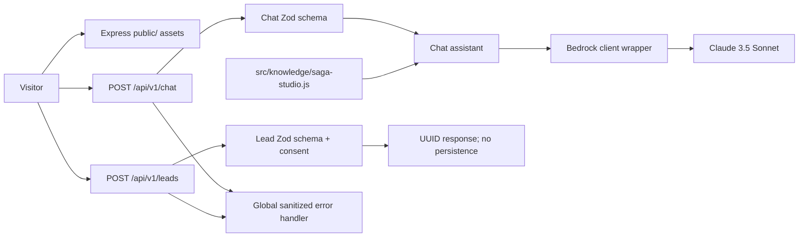

# Saga Studio Interactive Chat Assistant

An Express microservice that serves a static landing page and chat widget, answers visitor questions using Claude 3.5 Sonnet on Amazon Bedrock, and validates lead submissions.

## Problem

Prospective clients need a simple way to learn about Saga Studio's creative services and share project requirements. This service combines studio knowledge with conversational AI and exposes a consent-validated lead endpoint. It deliberately does not log conversation content.

## Project layout

```text
├── public/
│   ├── index.html
│   ├── chat.js
│   └── styles.css
├── helpers.js
├── src/
│   ├── app.js
│   ├── server.js
│   ├── config/env.js
│   ├── controllers/
│   │   ├── chat.js
│   │   └── leads.js
│   ├── knowledge/saga-studio.js
│   ├── middleware/error-handler.js
│   ├── routes/
│   │   ├── chat.js
│   │   └── leads.js
│   ├── schemas/
│   │   ├── chat.js
│   │   └── leads.js
│   └── services/
│       ├── bedrock-client.js
│       ├── chat-assistant.js
│       └── lead-service.js
└── test/
    ├── chat.test.js
    └── leads.test.js
```

## Setup

Requirements: Node.js 20+, npm, an AWS account with access to Amazon Bedrock, and Claude 3.5 Sonnet enabled in the selected region.

1. Install dependencies: `npm install`.
2. Copy `.env.example` to `.env`.
3. Set `AWS_REGION` and `BEDROCK_MODEL_ID`. Use AWS profiles or IAM roles for credentials; do not commit keys.
4. Run automated tests (no AWS call): `npm test`.
5. Start the service: `npm start`.
6. Open `http://localhost:3000/` for the static page.

## Environment

| Variable | Default | Purpose |
| --- | --- | --- |
| `PORT` | `3000` | HTTP listening port. |
| `AWS_REGION` | empty | AWS region for Bedrock. |
| `BEDROCK_MODEL_ID` | Claude 3.5 Sonnet v2 model ID | Bedrock model ID or supported inference profile. |
| `BEDROCK_TIMEOUT_MS` | `30000` | Request timeout in milliseconds. |
| `MAX_REQUEST_BYTES` | `16384` | Maximum JSON request size. |

The AWS SDK uses its standard credential provider chain. Optional credential variable names are shown blank in `.env.example`; prefer IAM roles outside local development.

## API

JSON endpoints return `Cache-Control: no-store`. Validation errors return HTTP 400 in the form `{ "error": "Validation failed", "details": [{ "path": "...", "message": "..." }] }`. Unexpected provider and server errors return a generic HTTP 500 response without stack traces.

### `GET /health`

Returns HTTP 200:

```json
{ "status": "ok" }
```

This is a process-level check and does not probe Bedrock connectivity or IAM permissions.

### `POST /api/v1/chat`

Request body is an array of 1–12 message objects. Each role must be `user` or `assistant`, roles alternate sequentially, the first and last roles are `user`, and content contains 1–1000 characters.

```json
[
  { "role": "user", "content": "What services does Saga Studio offer?" }
]
```

Successful response:

```json
{
  "reply": "Saga Studio offers video production, branding, UI/UX design, web development, and social media management.",
  "lead": null,
  "missingFields": ["name", "email", "need", "context", "consent"],
  "leadReady": false
}
```

When lead information has been volunteered in the conversation, `lead` contains the known fields (`name`, `email`, `whatsapp`, `need`, `context`, `consent`); unavailable values are `null`. `missingFields` reports required lead fields not yet present or explicitly consented. WhatsApp is optional. `leadReady` is true only when name, email, need, context, and explicit consent are present. The model must not infer or invent consent.

The chat passes visitor messages to the configured Bedrock model for processing. The application does not write chat contents to its own console or log files. Avoid sharing unnecessary sensitive information; apply TLS and appropriate privacy controls at deployment.

### `POST /api/v1/leads`

Required JSON fields: `name` (1–120 chars), `email` (valid email), `need` (exactly one allowed option), `context` (1–2000 chars), and `consent` (must be `true`). `whatsapp` is optional and, when supplied, must contain 7–20 characters.

Allowed `need` values:

- `Video Production`
- `Branding`
- `UI/UX Design`
- `Web Development`
- `Social Media Management`
- `Other`

Example:

```json
{
  "name": "Taylor",
  "email": "taylor@example.com",
  "whatsapp": "+628123456789",
  "need": "Branding",
  "context": "We are launching a new product and need a brand identity.",
  "consent": true
}
```

Success returns HTTP 201 with a generated identifier:

```json
{ "id": "generated-string-id" }
```

The current lead service generates a UUID but does not persist lead data. Add an approved storage backend and retention policy before relying on this endpoint for production lead capture.

## Architecture



## Limitations

- Model responses are constrained and validated as JSON, but generated answers may still be inaccurate; verify important business details.
- Claude 3.5 Sonnet request/response limits, latency, availability, and cost are governed by Bedrock, account quotas, and the selected region/model ID. This service applies a 30-second default timeout and a 900-token output budget.
- The health route does not verify AWS credentials, model access, network connectivity, or quota.
- Chat is stateless: the client must send the relevant alternating message history on each request; the API caps it at 12 messages.
- Leads are not persisted, and chat content is not logged. Configure consent, data retention, access control, TLS, abuse prevention, and a durable lead store appropriate to your deployment.

## Run evidence

In separate terminals:

```powershell
npm test
npm start
Invoke-RestMethod http://localhost:3000/health
```

Open `http://localhost:3000/` and submit a question in the chat widget. The UI also includes a consent-required lead form. Real chat requests require valid Bedrock credentials and model access; automated tests use a fake client and incur no AWS charges.
