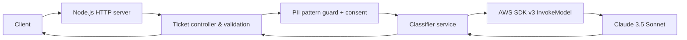

# Support-Ticket Classifier

Microservice Node.js (ES Modules) untuk mengklasifikasikan tiket dukungan melalui Claude 3.5 Sonnet di Amazon Bedrock. Implementasi menggunakan HTTP native Node.js dan AWS SDK v3.

## Problem Statement

Tiket dukungan perlu diringkas dan dikelompokkan secara konsisten berdasarkan kategori dan prioritas agar dapat diteruskan ke tim yang tepat. Service ini menyediakan endpoint stateless untuk klasifikasi serta menolak tiket dengan pola PII umum apabila persetujuan eksplisit tidak diberikan.

## Struktur proyek

```text
support-ticket-classifier/
├── .env.example
├── .gitignore
├── AI_DEV_LOG.md
├── package.json
├── README.md
├── src/
│   ├── app.js
│   ├── server.js
│   ├── config/
│   │   └── env.js
│   ├── controllers/
│   │   └── tickets.js
│   ├── services/
│   │   └── ticket-classifier.js
│   └── utils/
│       └── pii.js
└── test/
    └── tickets.test.js
```

## Setup dan instalasi

Persyaratan: Node.js 18.18+ dan npm.

1. Install dependency: `npm install`.
2. Salin `.env.example` menjadi `.env`.
3. Isi `AWS_REGION` dan `BEDROCK_MODEL_ID`. Untuk penggunaan lokal, atur kredensial AWS melalui environment atau AWS profile. Di deployment, utamakan IAM role/task role; jangan masukkan kredensial ke image atau source.
4. Pastikan akun AWS memiliki akses Bedrock dan model Claude 3.5 Sonnet tersedia/diaktifkan pada region tersebut.
5. Jalankan `npm test` untuk tes tanpa akses atau biaya AWS.
6. Jalankan `npm start`, lalu service mendengarkan pada port yang dikonfigurasi.

## Environment variables

| Variabel | Wajib | Default | Keterangan |
|---|---:|---|---|
| `PORT` | Tidak | `3000` | Port HTTP; harus integer positif. |
| `AWS_REGION` | Ya untuk Bedrock | — | AWS region, misalnya `us-east-1`. Health check degraded bila kosong. |
| `BEDROCK_MODEL_ID` | Ya untuk Bedrock | `anthropic.claude-3-5-sonnet-20241022-v2:0` | ID/inference profile model yang diizinkan pada akun dan region. |
| `AWS_ACCESS_KEY_ID` | Tidak | AWS credential chain | Kredensial lokal opsional; gunakan role di deployment. |
| `AWS_SECRET_ACCESS_KEY` | Tidak | AWS credential chain | Rahasia; jangan commit atau log. |
| `AWS_SESSION_TOKEN` | Tidak | — | Token sementara, bila memakai kredensial STS. |
| `BEDROCK_TIMEOUT_MS` | Tidak | `30000` | Timeout request model dalam milidetik. |
| `MAX_REQUEST_BYTES` | Tidak | `16384` | Batas ukuran body HTTP. |

AWS SDK menggunakan credential provider chain standar. Field access key pada `.env.example` sengaja kosong dan tidak divalidasi saat proses mulai.

## API

Semua respons JSON menggunakan `Cache-Control: no-store`.

### `POST /api/v1/tickets/classify`

Header: `Content-Type: application/json`

Request:

```json
{
  "ticketDescription": "Tagihan bulan ini tampak lebih tinggi dari biasanya.",
  "consentGiven": false
}
```

`ticketDescription` wajib berupa string dengan minimal 10 karakter setelah trim. `consentGiven` opsional, tetapi jika diberikan harus boolean. Jika pendeteksi menemukan PII umum seperti email, nomor telepon, SSN, atau pola nomor kartu, request harus memuat `"consentGiven": true`. Detektor berbasis pola ini bersifat best-effort dan bukan pengganti kontrol privasi/DLP. Jangan mengirim data yang tidak diperlukan; persetujuan harus didapatkan dari pengguna sebelum mengirim PII ke pihak pemroses AI.

Sukses (`200`):

```json
{
  "status": "success",
  "data": {
    "category": "Billing",
    "priority": "Medium",
    "summary": "Pelanggan menanyakan kenaikan tagihan bulan ini."
  }
}
```

Nilai `category`: `Billing`, `Technical`, `Account`, atau `General`. Nilai `priority`: `High`, `Medium`, atau `Low`. Service hanya menerima hasil model berbentuk JSON valid dengan kategori/prioritas tersebut; hasil model tidak valid diperlakukan sebagai kegagalan upstream.

Error umum: `400` validasi/JSON, `413` body terlalu besar, `415` content type tidak sesuai, `500` kegagalan internal termasuk exception AWS (tanpa stack trace), atau `502` respons model yang tidak valid/tidak dapat diproses.

### `GET /api/v1/tickets/health`

Respons `200` jika region dan model ID telah tersedia; `503` jika konfigurasi Bedrock belum lengkap.

```json
{
  "status": "healthy",
  "service": "support-ticket-classifier",
  "bedrock": {
    "regionConfigured": true,
    "modelConfigured": true
  }
}
```

Health check ini memeriksa konfigurasi lokal, bukan melakukan panggilan jaringan atau memvalidasi izin/availability Bedrock.

## Arsitektur



Deskripsi tiket tidak dicetak ke console atau log aplikasi. Error AWS/internal juga tidak dikirimkan mentah ke klien.

## Limitasi operasional

- PII detection menggunakan regex untuk pola umum dan dapat memiliki false positive/false negative. Terapkan DLP yang sesuai kebijakan sebelum produksi.
- Claude adalah model generatif; kategori, prioritas, dan ringkasan tetap perlu dievaluasi terhadap data dan kebijakan bisnis Anda.
- `max_tokens` respons model ditetapkan 300; timeout default 30 detik. Timeout dapat diatur melalui `BEDROCK_TIMEOUT_MS`.
- Batas request default 16 KiB. Tidak ada retry aplikasi; SDK mengatur maksimal dua percobaan untuk error yang dapat di-retry.
- Health check tidak memverifikasi kredensial, izin IAM, kuota, ketersediaan model, atau konektivitas Bedrock.
- Terapkan autentikasi, rate limiting, TLS, metrik, dan kebijakan retensi sesuai kebutuhan deployment; endpoint contoh ini belum menyediakan autentikasi.

## Bukti run (terminal / screenshot)

1. Jalankan `npm test` dan siapkan terminal yang menampilkan seluruh tes lulus.
2. Pada terminal kedua jalankan `npm start`; simpan tampilan log startup yang hanya memuat port.
3. Pada terminal ketiga, verifikasi health:

   ```powershell
   Invoke-RestMethod http://localhost:3000/api/v1/tickets/health
   ```

4. Uji validasi privasi tanpa memanggil Bedrock:

   ```powershell
   $body = @{ ticketDescription = "Hubungi saya di user@example.com untuk bantuan" } | ConvertTo-Json
   Invoke-RestMethod -Method Post -Uri http://localhost:3000/api/v1/tickets/classify -ContentType "application/json" -Body $body
   ```

   Permintaan ini seharusnya ditolak dengan HTTP 400 karena tidak ada consent. Untuk merekam klasifikasi sukses, pastikan AWS credentials, model access, region, dan model ID telah dikonfigurasi; gunakan deskripsi tanpa PII atau sertakan consent yang sah.
